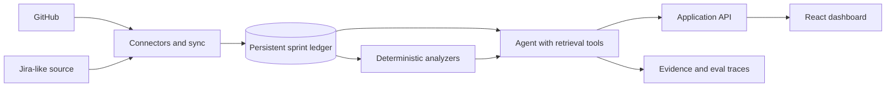

# Sprint Intelligence Agent

An engineering-management assistant that turns GitHub and Jira-style activity into an evidence-backed view of sprint health.

The agent maintains a persistent sprint ledger, compares snapshots over time, and answers questions such as:

- What changed since Monday?
- Which work is blocked, and what is it blocked by?
- Which tickets have gone stale?
- What new comments or decisions need attention?
- Which items put the sprint goal at risk?
- What should someone returning from holiday catch up on first?

## Why this project

Engineering teams already have plenty of issue and pull-request data. What they often lack is a trustworthy explanation of how that data changed, why it matters, and what needs attention now. This project is designed around that real workflow rather than around a generic chat interface.

## Product principles

- Evidence before summaries: every claim links back to its source event.
- History is first-class: snapshots and normalized events are retained in a sprint ledger.
- Rules plus AI: deterministic checks identify stale and blocked work; an agent explains and prioritizes the result.
- Human control: users approve mutations and outbound actions.
- Measurable quality: eval fixtures test change detection, citations, and risk classification.

## Planned architecture



See [docs/architecture.md](docs/architecture.md) for the system boundaries and data model.

## MVP

1. Connect one GitHub repository and import milestones, issues, pull requests, comments, reviews, and status changes.
2. Define a sprint and create immutable snapshots.
3. Show a timeline and answer “what changed since Monday?” with exact citations.
4. Detect blocked relationships, stale work, scope changes, and review bottlenecks.
5. Generate a concise sprint-risk report and holiday catch-up brief.
6. Ship a small evaluation set and record accuracy, latency, and cost.

## Repository status

The repository includes an interactive React dashboard, deterministic before/after sprint analysis, evidence-linked risk signals, a source-neutral SQLite ledger, and a read-only GitHub Projects connector. GitHub-specific data is normalized at the connector boundary so future Jira support does not change the ledger or analysis engine.

Run it locally:

```bash
npm install
npm run dev
```

This starts the ledger-backed API on port `8787` and the Vite dashboard on port `5173`. On first run, the API creates an ignored local SQLite database and seeds two demo snapshots so the complete persistence-to-dashboard path is immediately usable.

To ingest a real GitHub Project iteration, authenticate GitHub CLI with read-only Projects access, copy `.env.example` to `.env`, provide the Project/iteration identifiers, then run:

```bash
gh auth refresh -s read:project
```

```bash
npm run sync:github
```

The command reuses the active GitHub CLI login, normalizes the current iteration state, appends idempotent observation events, and creates an immutable snapshot. `GITHUB_TOKEN` remains available as an optional CI override; credentials are never written to the ledger or command output.

Quality checks:

```bash
npm test
npm run build
```

## Intended stack

- TypeScript application with separate browser and server boundaries
- React dashboard
- Node.js sync worker with provider-neutral connectors
- SQLite for local development and PostgreSQL for deployment
- Playwright for end-to-end coverage
- Vitest for unit and integration tests
- GitHub Actions for CI and agent evaluations

## Portfolio bar

Before calling the project complete, it should include a 60–90 second demo, screenshots, an architecture diagram, meaningful tests, eval results, latency/cost measurements, known failure modes, and one-command local setup.
