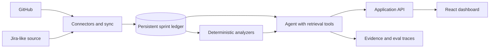

# Sprint Intelligence Agent

An engineering-management assistant that turns GitHub and Jira-style activity into an evidence-backed view of sprint health.

The agent maintains a persistent sprint ledger, compares snapshots over time, and answers questions such as:

- What changed since Monday?
- Which work is blocked, and what is it blocked by?
- Which tickets have gone stale?
- What new comments or decisions need attention?
- Which items put the sprint goal at risk?
- What should someone returning from holiday catch up on first?

## Why this project

Engineering teams already have plenty of issue and pull-request data. What they often lack is a trustworthy explanation of how that data changed, why it matters, and what needs attention now. This project is designed around that real workflow rather than around a generic chat interface.

## Product principles

- Evidence before summaries: every claim links back to its source event.
- History is first-class: snapshots and normalized events are retained in a sprint ledger.
- Rules plus AI: deterministic checks identify stale and blocked work; an agent explains and prioritizes the result.
- Human control: users approve mutations and outbound actions.
- Measurable quality: eval fixtures test change detection, citations, and risk classification.

## Planned architecture



See [docs/architecture.md](docs/architecture.md) for the initial system boundaries and [docs/project-brief.md](docs/project-brief.md) for the MVP.

## MVP

1. Connect one GitHub repository and import milestones, issues, pull requests, comments, reviews, and status changes.
2. Define a sprint and create immutable snapshots.
3. Show a timeline and answer “what changed since Monday?” with exact citations.
4. Detect blocked relationships, stale work, scope changes, and review bottlenecks.
5. Generate a concise sprint-risk report and holiday catch-up brief.
6. Ship a small evaluation set and record accuracy, latency, and cost.

## Repository status

Milestone 1 is in progress. The repository includes an interactive React dashboard, deterministic before/after sprint analysis, evidence-linked risk signals, and unit tests over a representative fixture sprint.

Run it locally:

```bash
npm install
npm run dev
```

Quality checks:

```bash
npm test
npm run build
```

See [the product research](docs/research/product-research-2026-09-21.md) for the competitive and API findings, and [the implementation plan](docs/implementation-plan.md) for the sequenced roadmap.

## Intended stack

- TypeScript monorepo
- React dashboard
- Node.js API and background sync worker
- PostgreSQL for the event ledger and snapshots
- Playwright for end-to-end coverage
- Vitest for unit and integration tests
- GitHub Actions for CI and agent evaluations

## Portfolio bar

Before calling the project complete, it should include a 60–90 second demo, screenshots, an architecture diagram, meaningful tests, eval results, latency/cost measurements, known failure modes, and one-command local setup.
