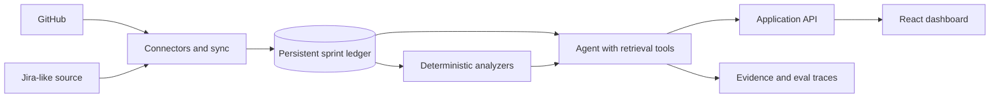

# Sprint Intelligence Agent

An engineering-management assistant that turns GitHub and Jira-style activity into an evidence-backed view of sprint health.

The agent maintains a persistent sprint ledger, compares snapshots over time, and answers questions such as:

- What changed since Monday?
- Which work is blocked, and what is it blocked by?
- Which tickets have gone stale?
- What new comments or decisions need attention?
- Which items put the sprint goal at risk?
- What should someone returning from holiday catch up on first?

## Why this project

Engineering teams already have plenty of issue and pull-request data. What they often lack is a trustworthy explanation of how that data changed, why it matters, and what needs attention now. This project is designed around that real workflow rather than around a generic chat interface.

## Product principles

- Evidence before summaries: every claim links back to its source event.
- History is first-class: snapshots and normalized events are retained in a sprint ledger.
- Rules plus AI: deterministic checks identify stale and blocked work; an agent explains and prioritizes the result.
- Human control: users approve mutations and outbound actions.
- Measurable quality: eval fixtures test change detection, citations, and risk classification.

## Planned architecture



See [docs/architecture.md](docs/architecture.md) for the system boundaries and data model.

## MVP

1. Connect one GitHub repository and import milestones, issues, pull requests, comments, reviews, and status changes.
2. Define a sprint and create immutable snapshots.
3. Show a timeline and answer “what changed since Monday?” with exact citations.
4. Detect blocked relationships, stale work, scope changes, and review bottlenecks.
5. Generate a concise sprint-risk report and holiday catch-up brief.
6. Ship a small evaluation set and record accuracy, latency, and cost.

## Repository status

The repository includes an interactive React dashboard, deterministic before/after sprint analysis, evidence-linked risk signals, a source-neutral SQLite ledger, a read-only GitHub Projects connector, and an evidence-constrained question-answering agent. Its setup flow discovers personal and organization projects from the active GitHub CLI login, stores the selected project and iteration in SQLite without storing credentials, and runs synchronization directly from the dashboard. The connector imports native blocker relationships plus timestamped comments and reviews, reconciles dependencies when they are removed, and records sync latency, API requests, throughput, and failures. Identical syncs do not create duplicate snapshots, concurrent syncs for one connection are rejected, and the first real snapshot can immediately power the dashboard. GitHub-specific data is normalized at the connector boundary so future Jira support does not change the ledger or analysis engine.

The agent can call only five typed, read-only ledger tools: sprint overview, snapshot changes, deterministic risks, work-item/blocker detail, and timestamped activity. Its runtime boundary is AI-provider-neutral: a hosted model, OpenAI-compatible local service, or custom agent module receives the same tool definitions and returns normalized tool calls. Model-generated claims are accepted only when every claim cites fact IDs retrieved during that run; the server resolves those facts to exact source links. Invalid or invented grounding triggers the deterministic fallback. Agent runs persist their tool trace, provider, model, latency, and token counts for audit and evaluation.

The public [demo sprint board](https://github.com/users/dorijantomic/projects/1) contains the live iteration, priorities, estimates, comments, scope change, and dependency chain used to exercise the connector end to end.

Run it locally:

```bash
npm install
npm run dev
```

This starts the ledger-backed API on port `8787` and the Vite dashboard on port `5173`. On first run, the API creates an ignored local SQLite database and seeds two demo snapshots so the complete persistence-to-dashboard path is immediately usable.

To connect a real GitHub Project iteration, authenticate GitHub CLI with read-only Projects access:

```bash
gh auth refresh -s read:project
```

Start the application, choose **Connect GitHub**, discover your projects, select an iteration, and use **Sync now**. The local API resolves the active CLI credential only when it talks to GitHub; credentials are never returned to the browser or written to SQLite.

For scripts or CI, the existing command-line path remains available: copy `.env.example` to `.env`, provide the Project and iteration identifiers, then run `npm run sync:github`. `GITHUB_TOKEN` remains available as an optional CI override.

AI narration is optional. Without an agent configuration, `/api/agent/ask` uses the deterministic analyzers and still returns structured claims, citations, and a tool trace.

The built-in runtime choices use generic `AGENT_*` settings:

```env
# No external model
AGENT_PROVIDER=deterministic

# OpenAI Responses adapter
AGENT_PROVIDER=openai
AGENT_MODEL=gpt-5.6
AGENT_API_KEY=...

# Any service implementing OpenAI-compatible Chat Completions, including
# local Ollama, LM Studio, or vLLM endpoints
AGENT_PROVIDER=openai-compatible
AGENT_BASE_URL=http://localhost:11434/v1
AGENT_MODEL=your-tool-capable-model
AGENT_API_KEY=local
```

Agents that use a different API are supplied as a runtime module:

```env
AGENT_PROVIDER=custom
AGENT_RUNTIME_MODULE=./local/my-agent-runtime.ts
```

That module exports `createAgentRuntime` (or a default factory) returning the `AgentRuntime` contract from `server/agent/runtime/types.ts`. It can use Anthropic, Gemini, a local CLI agent, an internal service, or another implementation. The runtime only requests typed tool calls; Orbit executes those calls, validates cited fact IDs, and resolves evidence itself. This keeps provider credentials and SDK details outside the sprint ledger and trust boundary. Existing `OPENAI_API_KEY` and `OPENAI_MODEL` settings continue to work as a backward-compatible OpenAI shortcut.

Quality checks:

```bash
npm test
npm run build
npm run eval
```

The evaluation gate replays versioned sprint histories and measures factual correctness, citation coverage, unsupported-claim rate, runtime, model calls, and estimated cost. It writes a machine-readable report to the ignored `.artifacts/eval-report.json` path and exits nonzero if a threshold regresses. GitHub Actions runs the same tests, build, and eval gate for pushes and pull requests, then uploads the report as a workflow artifact.

## Intended stack

- TypeScript application with separate browser and server boundaries
- React dashboard
- Node.js sync service with provider-neutral connectors
- SQLite for local development and PostgreSQL for deployment
- Vitest for unit and integration tests
- GitHub Actions for CI and agent evaluations

## Portfolio bar

Before calling the project complete, it should include a 60–90 second demo, screenshots, an architecture diagram, meaningful tests, eval results, latency/cost measurements, known failure modes, and one-command local setup.
