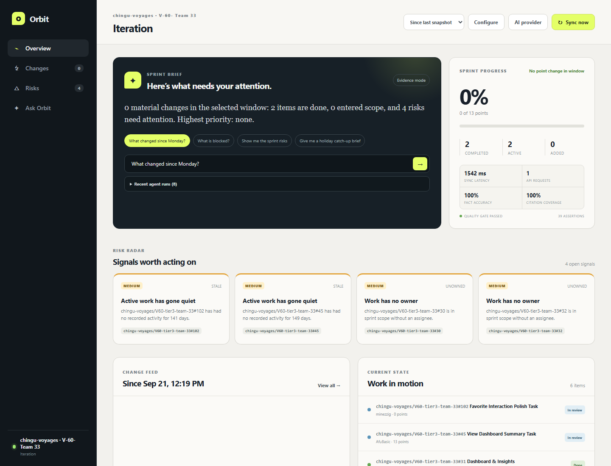
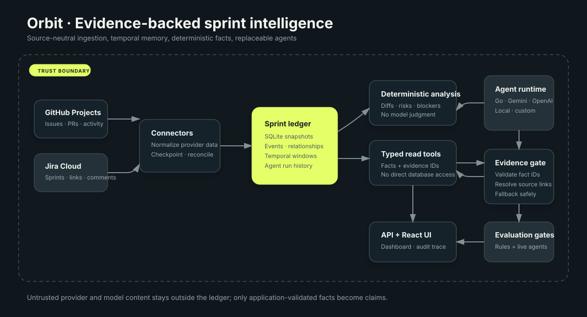

# Orbit · Sprint Intelligence Agent

An evidence-backed engineering-management agent for GitHub Projects and Jira Cloud. Orbit keeps a persistent sprint ledger, compares real historical snapshots, detects risk deterministically, and lets any tool-capable AI runtime explain what changed without inventing facts.



## What it answers

- What changed since Monday—or any selected date?
- Which work is blocked, and what is it blocked by?
- Which active items have gone stale?
- What new comments and reviews need attention?
- What threatens the sprint goal?
- What should someone returning from holiday read first?

Every answer includes exact work-item or activity evidence. Model claims are accepted only when their cited fact IDs were returned by a typed ledger tool during that run; invalid grounding falls back to the deterministic engine.

## Architecture



GitHub and Jira normalize their native objects into one source-neutral SQLite ledger. Immutable snapshots and timestamped activity feed deterministic analyzers. A replaceable agent runtime can request five narrow, read-only tools, but it never receives database access. Orbit validates submitted claims, resolves source links itself, and stores the complete audit trace.

See [the architecture notes](docs/architecture.md) for the data boundaries and trust model.

## Run locally

Requirements: Node.js 24+ and, for GitHub sync, an authenticated GitHub CLI.

```bash
git clone https://github.com/dorijantomic/sprint-intelligence-agent.git
cd sprint-intelligence-agent
npm run start:local
```

Open `http://localhost:5173`. The launcher installs dependencies when needed, starts the API on `8787`, starts the React dashboard on `5173`, and seeds a demo ledger on first run.

### Connect GitHub Projects

```bash
gh auth refresh -s read:project
```

Choose **Connect source → GitHub Projects**, discover a project and iteration, save it, then select **Sync now**. Orbit reads the active CLI credential at request time; it never returns that credential to the browser or writes it to SQLite.

### Connect Jira Cloud

Choose **Connect source → Jira Cloud** and enter the site URL, Atlassian email, API token, sprint ID, and optional story-point custom field. Jira integration is read-only and imports sprint metadata, work items, comments, status, ownership, priorities, estimates, and blocker links.

Connector tokens live outside SQLite in ignored `.data/source-secrets.json` with owner-only permissions. A hosted deployment should replace this local store with a managed secret service.

## Bring your own agent

AI narration is optional. Without a provider, Orbit still returns deterministic, structured claims and citations. Open **AI provider** to configure and test a runtime without restarting the app.

| Runtime | Protocol | Typical use |
| --- | --- | --- |
| OpenCode Go | Responses or Chat Completions | Subscription models such as `gpt-5.6-luna` |
| Google Gemini | OpenAI-compatible Chat Completions | An AI Studio key |
| OpenAI | Responses API | Hosted OpenAI models |
| OpenAI-compatible | Chat Completions | Ollama, LM Studio, vLLM, or another gateway |
| Custom module | `AgentRuntime` contract | Anthropic, a CLI agent, or an internal service |

UI secrets are stored in ignored `.data/agent-config.json` with mode `0600` and are never returned after submission. Environment configuration takes precedence and makes UI settings read-only:

```env
AGENT_PROVIDER=opencode-go
AGENT_MODEL=gpt-5.6-luna
AGENT_API_KEY=...
```

OpenCode Go uses its `/zen/go/v1` gateway. `gpt-5.6-luna` uses the Responses adapter; Go models documented as OpenAI-compatible use the Chat Completions adapter. Models whose Go endpoint uses the Anthropic Messages protocol can be supplied through a custom runtime module.

A custom module exports `createAgentRuntime` or a default factory implementing `server/agent/runtime/types.ts`. The same typed tools and evidence gate apply regardless of provider.

## Quality and evaluations

```bash
npm test
npm run build
npm run eval
```

The deterministic evaluation gate replays versioned sprint histories, exits nonzero on regression, and writes `.artifacts/eval-report.json`. Current baseline: **39/39 assertions**, **100% factual correctness**, **100% citation coverage**, and **0% unsupported claims** across three scenarios. The checked-in summary is [docs/assets/eval-results.json](docs/assets/eval-results.json).

Live agent evaluations make real provider calls and therefore require an explicit cost acknowledgement:

```bash
npm run eval:live -- --confirm-cost
# or one scenario
npm run eval:live -- --confirm-cost --scenario blocked-chain
```

The live report records model/tool selection, grounding, calls, latency, tokens, and estimated cost in `.artifacts/live-eval-report.json`. The current OpenCode Go / `gpt-5.6-luna` run passed **3/3 scenarios** with a **100% grounded-claim rate** in **25.2 seconds**, using **17,973 tokens** across 11 calls at an estimated **$0.00550**. GitHub Actions runs the deterministic test, build, and eval gates for every push and pull request.

## 60–90 second demo route

1. Show a connected project and select **Since Monday**.
2. Sync and point out whether a new immutable snapshot was created.
3. Ask “What changed since Monday?” and open the exact evidence links.
4. Ask “What is blocked?” and show the blocker chain.
5. Expand the agent audit trace to show typed calls, fact IDs, tokens, and fallback state.
6. Open **AI provider** to show that the model is replaceable while the ledger and evidence gate stay fixed.
7. Finish on the quality card and evaluation results.

## Known failure modes and boundaries

- GitHub personal Projects do not currently have the same Projects v2 webhook coverage as organization projects, so the local product uses explicit reconciliation syncs.
- Jira story-point fields are instance-specific; setup defaults to `customfield_10016` and lets the operator override it.
- The first snapshot cannot reconstruct history that was never ingested. Orbit marks requested windows as incomplete instead of implying full coverage.
- Provider quotas, unsupported tool-calling models, or malformed model claims trigger an explicit deterministic fallback recorded in the audit trace.
- Direct sync is intentionally optimized for a local/small-team product. A hosted installation should add signed webhooks, durable jobs, reconciliation polling, managed secrets, and tenant isolation.
- All source and agent tools are read-only. Mutating tickets or publishing briefs would require a separate human-approval boundary.

## Current implementation

- React/TypeScript dashboard with real temporal-window controls
- SQLite ledger with immutable snapshots, events, relationships, sync runs, and agent runs
- Read-only GitHub Projects and Jira Cloud connectors
- Blockers, staleness, scope change, review risk, and holiday catch-up analysis
- Five typed ledger tools and a provider-neutral agent runtime
- Claim/evidence validation with deterministic fallback
- In-UI agent configuration and auditable run history
- Unit, integration, deterministic eval, live eval, and CI quality gates
